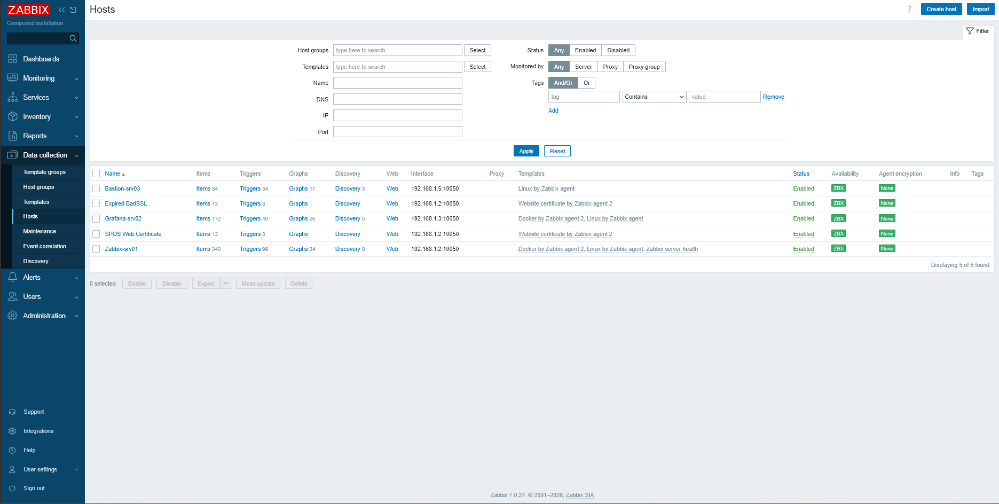
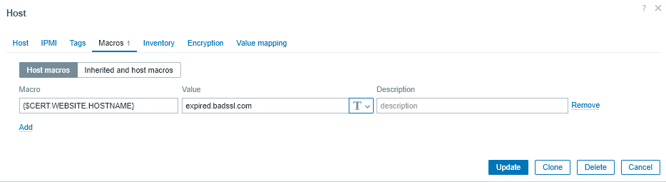
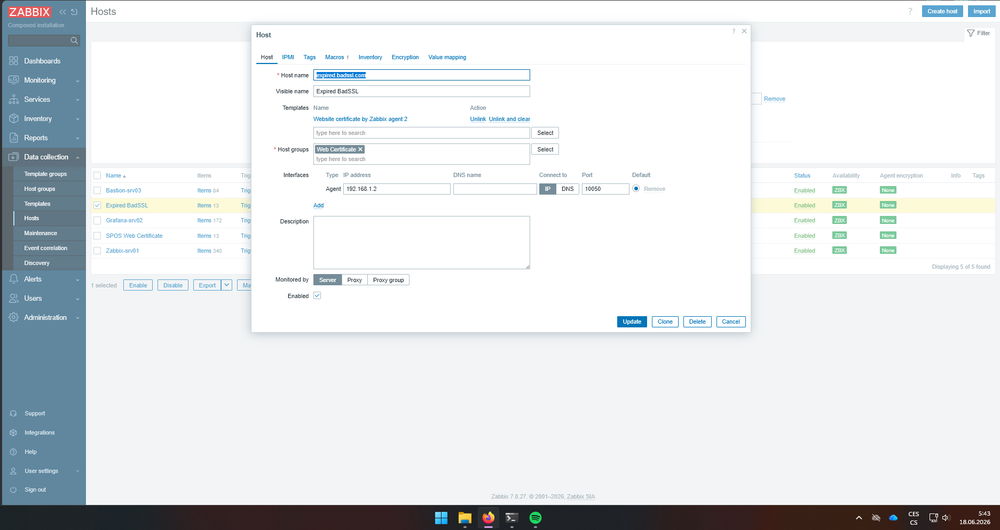
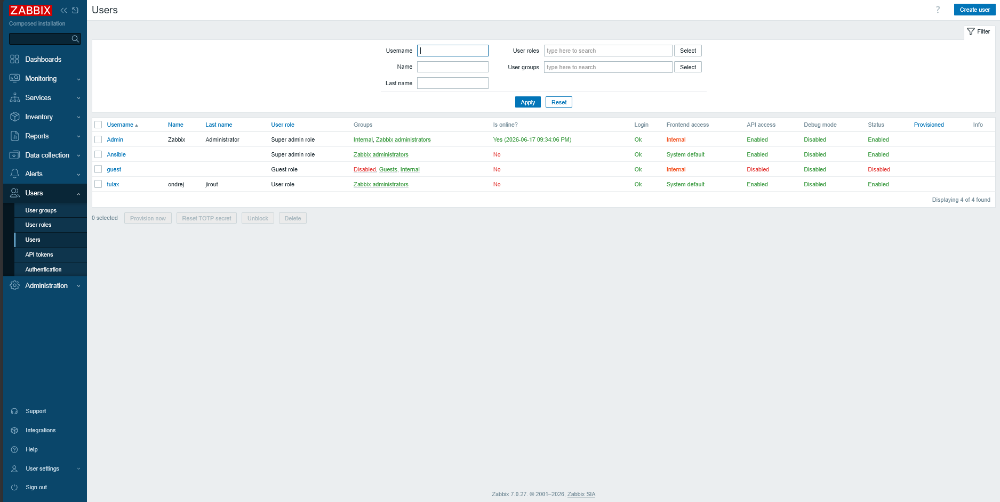
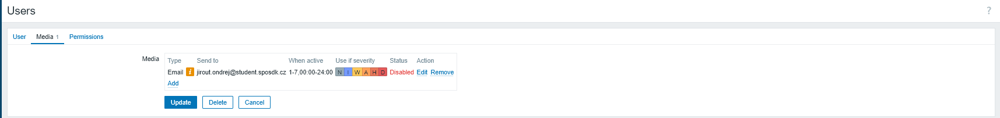
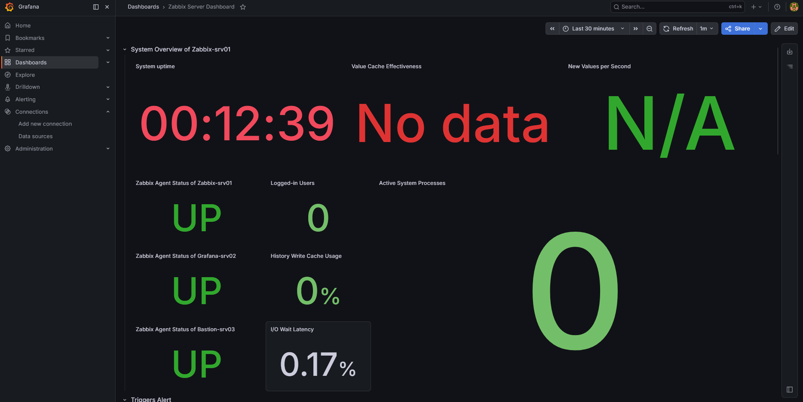

zde jsou videt vsechni hosti 

zde co ten host dela 

zde co ma za sablonu

zde jsou videt uzivatele 

zde je videt ze uzivatej je napsan na muj mail


zde je videt , ze jede grafana 


Vyexportovaný host se nachází [zde](host.yaml)


zde jsou  kod pro pridani hosta 
- name: Create Zabbix host for badssl website
  community.zabbix.zabbix_host:
    host_name: expired.badssl.com
    visible_name: Expired BadSSL
    host_groups:
      - Web Certificate
    link_templates:
      - Website certificate by Zabbix agent 2
    interfaces:
      - type: 1
        main: 1
        useip: 1
        ip: 192.168.1.2
        dns: ""
        port: "10050"
    macros:
      - macro: "{$CERT.WEBSITE.HOSTNAME}"
        value: "expired.badssl.com"
    state: present

zde je cast kodu pro pridani usera
- name: Create custom zabbix user
  community.zabbix.zabbix_user:
    username: "tulax"
    name: "ondrej"
    surname: "jirout"
    passwd: "nevimnevim123"
    usrgrps:
      - "Zabbix administrators"
    user_medias:
      - mediatype: Email
        sendto:
          - jirout.ondrej@student.sposdk.cz
    state: present


# Zadání

[](https://classroom.github.com/a/cCPQDIPk)
# Zabbix vs Grafana automatizece

Repository pro vyuku na SPOS DK

Tento projekt vznikl jako klon [maturitní práce](https://prace.pslib.cz/ideas/6853), kterou vypracoval [Jan Mizera](https://github.com/JanMizera/MP-Automatizovana-instalace-a-sprava-Grafana-pomoci-Ansible) a polouží k výuce Ansible na SPOS DK.
Vzorem byl [projekt](https://github.com/smejdil/zabbix-grafana).


### Závislosti

1. **Vagrant 2.4.9-1** – dostupné online na: https://developer.hashicorp.com/vagrant/install
2. **VirtualBox 7.2.6** – dostupné online na: https://www.virtualbox.org/wiki/Downloads
3. **Git 2.52.0** – dostupné online na: https://git-scm.com/install/
4. **Docker 29.3.1-1** - dostupné online na: https://www.docker.com/get-started/
5. **Zabbix 7.0.24 LTS** - dostupné online na: https://www.zabbix.com/download
6. **Ansible 2.20.4** - dostupné online na: https://www.redhat.com/en/ansible-collaborative
7. **Zabbix collection for Ansible 4.1.1** - dostupné online na: https://galaxy.ansible.com/ui/repo/published/community/zabbix/ 

## Návod ke spuštění

### 1. Stažení projektu
Stažení projektu pomocí příkazu `git clone` v prázdném adresáři:

```bash
cd work/spos/
git clone https://github.com/sposdknl/zbx7-grafana.git
```

### 2. Spuštění projektu
Spuštění infrastruktury pomocí příkazu:

```bash
vagrant up
```

**Upozornění:** V případě zaseknutí při práci s SSH klíči je potřeba otevřít danou VM přes GUI VirtualBoxu. Pokud dojde k timeoutu, je potřeba prostředí smazat a spustit znovu:

```bash
vagrant destroy -f
vagrant up
```

### 3. Konfigurace serverů
Po dokončení běhu je dostupné:
* **Zabbix GUI:** http://localhost:8002 (Uživatel: `Admin`, Heslo: `Zabbix`)
* **Grafana GUI:** http://localhost:3000 (Uživatel: `admin`, Heslo: `GrafanaUltimateAdminPassword123`)

Pro samotnou konfiguraci se připojte na **Bastion-SRV03** přes Vagrant:

```bash
vagrant ssh bastion-srv03
```

Následně přejděte do adresáře projektu a spusťte playbooky pomocí Ansible:

```bash
cd /opt/repo
ansible-playbook configure_zabbix_server.yml
sudo ansible-playbook configure_grafana_server.yml
```

### 4. Zobrazení výsledků
* Po úspěšném provedení první role uvidíte v GUI Zabbixu přidané hosty.
* Po úspěšném provedení druhé role uvidíte v GUI Grafany přidané dashboardy, na kterých se zobrazují data ze Zabbixu.

---

## Předpoklady a řešení problémů s boxem

Při prvních spuštěních projektu nastal problém, kdy Vagrant nebyl schopen nainstalovat box `bento/ubuntu-24.04` z Vagrant cloudu. Nyní by již automatický import měl fungovat, ale v případě potíží postupujte následovně:

### 1. Ruční stažení Vagrant Boxu
1. **Stáhněte** box `bento/ubuntu-24.04` (verze pro `amd64` / VirtualBox) z oficiálního Vagrant Cloudu.
2. **Přejmenujte** soubor na: `bento-ubuntu-24.04-virtualbox.box`.
3. **Přesuňte** soubor do kořenového adresáře tohoto projektu.

### 2. Import Boxu do Vagrantu
Spusťte příkaz pro ruční přidání boxu do lokální Vagrant cache z kořenového adresáře:

```bash
vagrant box add bento/ubuntu-24.04 bento-ubuntu-24.04-virtualbox.box --provider virtualbox
```

### 3. Spuštění projektu
Nyní pokračujte podle standardního návodu výše (krok `vagrant up`).